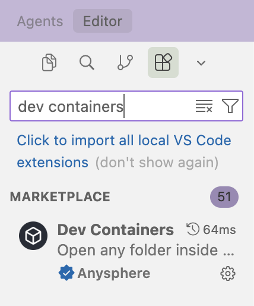
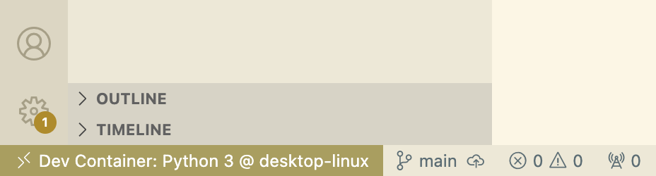
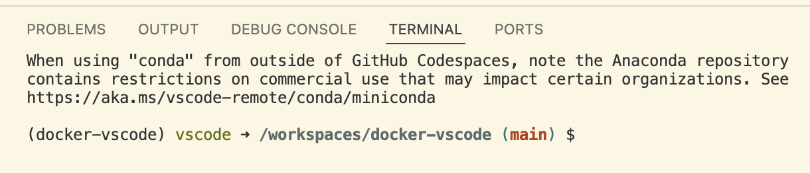

# How to use docker image in VScode and Cursor?

This tutorial guides you through using VS Code Dev Containers within VS Code or Cursor. The setup process is virtually identical for both editors, so you can follow these instructions regardless of which one you prefer.

## Prerequisites

This tutorial assumes you have:
- Created a `environment.yml` and `conda-lock.yml` for your project
- Installed Docker, VS Code or Cursor
- Familiarity with conda, conda-lock, and Docker containers

If you need to review these concepts, please refer to:
* [conda-lock](https://ubc-dsci.github.io/reproducible-and-trustworthy-workflows-for-data-science/lectures/090-conda-lock.html)
* [Introduction to containerization](https://ubc-dsci.github.io/reproducible-and-trustworthy-workflows-for-data-science/lectures/100-containerization-1.html)
* [Using and running containers](https://ubc-dsci.github.io/reproducible-and-trustworthy-workflows-for-data-science/lectures/110-containerization-2.html)
* [Customizing and building containers](https://ubc-dsci.github.io/reproducible-and-trustworthy-workflows-for-data-science/lectures/120-containerization-3.html)

## How to Use VS Code Dev Containers with `Dockerfile`

VS Code dev containers work differently from JupyterLab or RStudio containers that you used before. Instead of accessing a URL through a port, VS Code containers run directly within your local VS Code IDE using the "Dev Containers" extension, or on GitHub Codespaces.

Follow these steps to build and run a Docker container using a VS Code image:

1. Start VS Code and open your project folder.

2. Install the "Dev Containers" VS Code extension (the first result shown in the image below).


Or if you are using Cursor, the "Dev Containers" Cursor extension looks like this: 


3. Create a `devcontainer.json` file:
   - You can copy this folder `.devcontainer` in this repository directoy, or you can create a folder called `.devcontainer` in your project's root directory
   - Inside this folder, create a file called `devcontainer.json`
   - VS Code uses this file to configure and customize the container
   - For more information, see the [VS Code documentation](https://code.visualstudio.com/docs/devcontainers/create-dev-container)
   - In this tutorial, we use the following command to build the container using your existing `Dockerfile`:
```json
   "build": {
       // Path is relative to the devcontainer.json file.
       "dockerfile": "Dockerfile"
   }
```

4. We use following command in your `environment.yml` file to build conda-lock file for various operating systems, including `linux-aarch64`:
```yaml
   platforms:
    - linux-aarch64
    - linux-64
    - osx-arm64
    - osx-64
    - win-64
```

5. Generate the conda-lock file by running this command in your terminal:
```bash
   conda-lock lock --file environment.yml
```

6. Move your `Dockerfile` and the newly generated `conda-lock.yml` file into the `.devcontainer` folder.

7. In the VS Code left navigation bar, click the "Remote Explorer" icon (see image below) to open the sidebar.


8. Click "Open Folder in Container".


9. Select your current project folder to open.

10. The initial build will take some time. Subsequent builds will be faster.


11. If the build succeeds, you will see "Dev Container: Python 3 @ desktop-linux" in the bottom left corner. The name "Python 3" comes from the `devcontainer.json` file and can be changed to your preference.


12. This `Dockerfile` is configured to activate the conda environment automatically. You should see `(docker-vscode)` in your terminal.


## How to Use VS Code Dev Containers with `docker-compose.yml`

For simple data analysis projects, using `Dockerfile` and `devcontainer.json` together is sufficient. However, if your project requires multiple containers, you'll need to use `docker-compose.yml`.

This tutorial includes both configuration options in the `.devcontainer` folder for flexibility. You can choose to build your container using either the `Dockerfile` directly or through `docker-compose.yml`, depending on your project's needs.

To switch between the two approaches, simply comment/uncomment the relevant sections in `devcontainer.json`:

```json
{
	"name": "Python 3",
	// uncomment below to use Dockerfile
	//"build": {
        // Path is relative to the devcontainer.json file.
        //"dockerfile": "Dockerfile"
    //},

	// uncomment below to use Docker Compose file
	"dockerComposeFile": "docker-compose.yml",
    "service": "devcontainer",
    "workspaceFolder": "/workspaces/${localWorkspaceFolderBasename}"
}
```

## References
* [VS Code image](https://hub.docker.com/r/microsoft/vscode-devcontainers)
* [Create Dev Container](https://code.visualstudio.com/docs/devcontainers/create-dev-container)
* [Using Images, Dockerfiles, and Docker Compose](https://containers.dev/guide/dockerfile)
