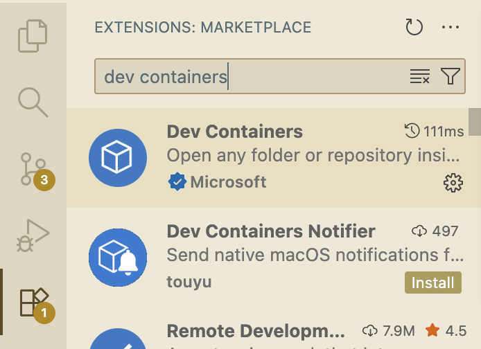
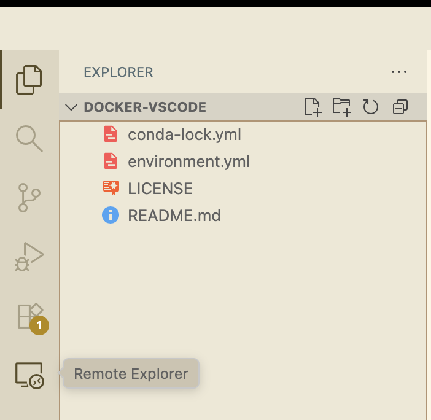
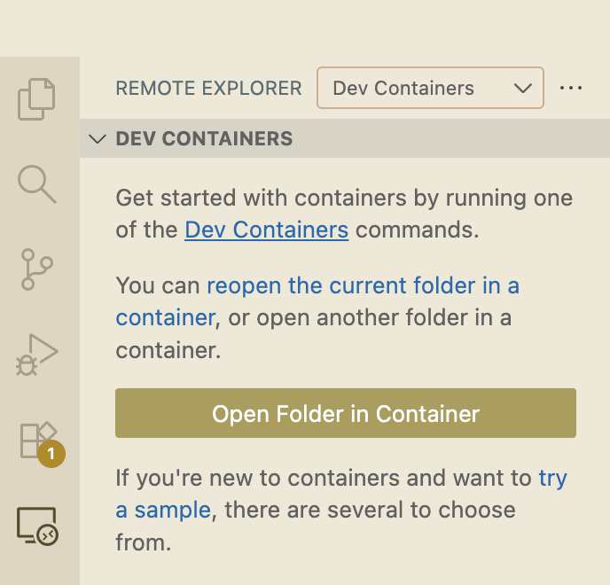

# docker-vscode

## preprequisites

This tutorial assumes that you have already created a conda-lock file that includes Linux-64 operating system for your project. It also assumes that you have installed docker, installed VS code, are familiar with conda, conda-lock, and docker container.

If you need to review those concepts mentioned above, please refer to :
* [conda-lock](https://ubc-dsci.github.io/reproducible-and-trustworthy-workflows-for-data-science/lectures/090-conda-lock.html)
* [Introduction to containerization](https://ubc-dsci.github.io/reproducible-and-trustworthy-workflows-for-data-science/lectures/100-containerization-1.html)
* [Using and running containers](https://ubc-dsci.github.io/reproducible-and-trustworthy-workflows-for-data-science/lectures/110-containerization-2.html)
* [Customizing and building containers](https://ubc-dsci.github.io/reproducible-and-trustworthy-workflows-for-data-science/lectures/120-containerization-3.html)


## How to use VSCode docker container?

VSCode docker container is different from how you used jupyterLab container, R Studio container before (for those containers, you can open a URL hosted on your local computer and being connected through a port). VSCode can only work inside of your local VSCode IDE installed locally using the "Dev Containers" extension; or on GitHub Codespaces.

Below are the steps that you need to take to build and run a docker container using VScode image.
1. start VS code, open your project folder
2. install "Dev Containers" VS code extension (the first returned result shown in the image below)

3. Create devcontainer.json file 
* create a file called `devcontainer.json` under a folder called `.devcontainer` in the root directory. 
* VS code use `devcontainer.json` to configure and customize the container
* You can read more about `devcontainer.json` [here](https://code.visualstudio.com/docs/devcontainers/create-dev-container)
* in this tutorial, we use the following command to instruct the VS code container to build using our existing `Dockerfile`: 

```
    "build": {
            // Path is relative to the devcontainer.json file.
            "dockerfile": "Dockerfile"
        }
```
4. Move your `Dockerfile` and `conda-lock.yml` file to be inside of `.devcontainer` folder.
5. In your left navigation bar, you should see an icon that looks like a screen "Remote Explorer" (see image below), click on it to open a left side bar

6. Click on the button "Open Folder in Container"

7. Select your project folder


## Reference
* [vscode image](https://hub.docker.com/r/microsoft/vscode-devcontainers)
* [Create Dev Container](https://code.visualstudio.com/docs/devcontainers/create-dev-container)
* [Using Images, Dockerfiles, and Docker Compose](https://containers.dev/guide/dockerfile)
* 